# Financial Sentiment Analysis

A deep learning project for sentiment classification of financial texts using transformer models. Compares domain-specific FinBERT against general-purpose RoBERTa on the Financial PhraseBank dataset.

## Project Overview

**Task:** Three-class sentiment classification of financial news sentences:
- **Positive** — optimistic sentiment (growth, profit, success, expansion)
- **Neutral** — factual statements without sentiment
- **Negative** — pessimistic sentiment (losses, decline, problems, risks)

**Goal:** Demonstrate that domain-specific pretrained models (FinBERT) outperform general-purpose models (RoBERTa) on financial NLP tasks.

---

## Installation

### Prerequisites

- Python 3.10+
- NVIDIA GPU with 6+ GB VRAM (recommended)
- CUDA 11.7+ (for GPU acceleration)

### Setup

```bash
# Clone repository
git clone <repository-url>
cd financial-sentiment-analysis

# Create virtual environment
python -m venv .venv

# Activate (Windows)
.venv\Scripts\activate

# Activate (Linux/Mac)
source .venv/bin/activate

# Install dependencies
pip install -r requirements.txt
```

### Dependencies

Core libraries:
- `torch` — Deep learning framework
- `transformers` — HuggingFace transformer models
- `datasets` — HuggingFace dataset loading
- `scikit-learn` — Evaluation metrics
- `matplotlib`, `seaborn` — Visualization
- `pandas`, `numpy` — Data manipulation
- `tqdm` — Progress bars

---

## Usage

### Running the Notebooks

**Part 1: Exploratory Data Analysis**
```bash
jupyter notebook notebooks/01_data_analysis.ipynb
```
- Loads and explores the Financial PhraseBank dataset
- Generates class distribution plots, word clouds, sentence length histograms
- Saves processed data and statistics

**Part 2: Model Training and Evaluation**
```bash
jupyter notebook notebooks/02_model_training.ipynb
```
- Creates train/val/test splits
- Trains RoBERTa (baseline) and FinBERT models
- Evaluates on test set with confusion matrices
- Performs error analysis
- Demonstrates inference on new texts

**Part 3: Multilingual Model (XLM-RoBERTa)**
```bash
jupyter notebook notebooks/03_xlm_roberta_training.ipynb
```
- Trains XLM-RoBERTa for cross-lingual sentiment analysis
- Tests zero-shot transfer to Spanish
- Interactive demo for multilingual inference

### Using Trained Models for Inference

```python
from src.models import SentimentPredictor

# Load the best model
predictor = SentimentPredictor(
    model_path="outputs/models/finbert/best_model.pt",
    tokenizer_name="ProsusAI/finbert"
)

# Single prediction
result = predictor.predict("Revenue increased by 25% year-over-year.")
print(f"Sentiment: {result['prediction']}, Confidence: {result['confidence']:.1%}")
# Output: Sentiment: positive, Confidence: 94.2%

# Batch prediction
texts = [
    "The company reported record quarterly earnings.",
    "Operations remained stable throughout the period.",
    "Significant losses were recorded due to market downturn."
]
results = predictor.predict(texts)
for text, pred in zip(texts, results['predictions']):
    print(f"{pred}: {text}")
```

### Multilingual Inference (XLM-RoBERTa)

```python
from src.models import SentimentPredictor

# Load multilingual model
predictor = SentimentPredictor(
    model_path="outputs/models/xlm-roberta/best_model.pt",
    tokenizer_name="xlm-roberta-base"
)

# Works with multiple languages (trained on English only!)
predictor.predict("Revenue increased by 25%.")                      # English → positive
predictor.predict("Los ingresos aumentaron un 25%.")                # Spanish → positive
predictor.predict("Компания объявила о рекордной прибыли.")         # Russian → positive
```

---

## Project Structure

```
financial-sentiment-analysis/
│
├── notebooks/
│   ├── 01_data_analysis.ipynb      # Exploratory data analysis
│   ├── 02_model_training.ipynb     # Model training and evaluation
│   └── 03_xlm_roberta_training.ipynb  # Multilingual model training
│
├── src/
│   ├── data/
│   │   ├── loader.py               # Dataset loading from HuggingFace
│   │   ├── preprocessor.py         # Text cleaning and preprocessing
│   │   ├── analyzer.py             # Dataset statistics and analysis
│   │   └── dataset.py              # PyTorch Dataset and DataLoaders
│   │
│   ├── models/
│   │   ├── classifier.py           # SentimentClassifier wrapper
│   │   ├── trainer.py              # Training loop with early stopping
│   │   ├── evaluator.py            # Metrics and evaluation
│   │   └── predictor.py            # Production inference wrapper
│   │
│   ├── visualization/
│   │   ├── plots.py                # EDA visualizations
│   │   └── training_viz.py         # Training curves and confusion matrices
│   │
│   └── utils/
│       └── helpers.py              # Device detection, seeding, logging
│
├── config/
│   ├── paths.py                    # Project paths (DATA_DIR, OUTPUT_DIR, etc.)
│   ├── params.py                   # Label mappings, split ratios
│   └── model_config.py             # ModelConfig dataclass, model configurations
│
├── outputs/
│   ├── figures/                    # Generated plots (PNG)
│   ├── models/                     # Saved model checkpoints
│   ├── reports/                    # Analysis reports
│   └── logs/                       # Training logs
│
├── experiments/
│   └── results.json                # Experiment metrics and comparison
│
├── data/
│   ├── raw/                        # Original data
│   ├── processed/                  # Cleaned data
│   └── splits/                     # Train/val/test CSVs
│
├── requirements.txt
├── CLAUDE.md                       # Development guidelines
└── README.md
```

---

## Dataset

### Financial PhraseBank

Source: [HuggingFace Datasets](https://huggingface.co/datasets/takala/financial_phrasebank) (Malo et al., 2014)

A collection of financial news sentences annotated by 16 finance professionals. We use the **75% agreement** subset where at least 12 out of 16 annotators agreed on the label.

| Statistic | Value |
|-----------|-------|
| Total sentences | 3,453 |
| Vocabulary size | ~8,500 unique words |
| Avg. sentence length | 23 words |
| Agreement threshold | 75% (12/16 annotators) |

### Class Distribution

| Class | Count | Percentage |
|-------|-------|------------|
| Neutral | 2,146 | 62.2% |
| Positive | 887 | 25.7% |
| Negative | 420 | 12.2% |

The dataset exhibits significant class imbalance with neutral sentences being dominant. This reflects real-world financial news distribution where most statements are factual.

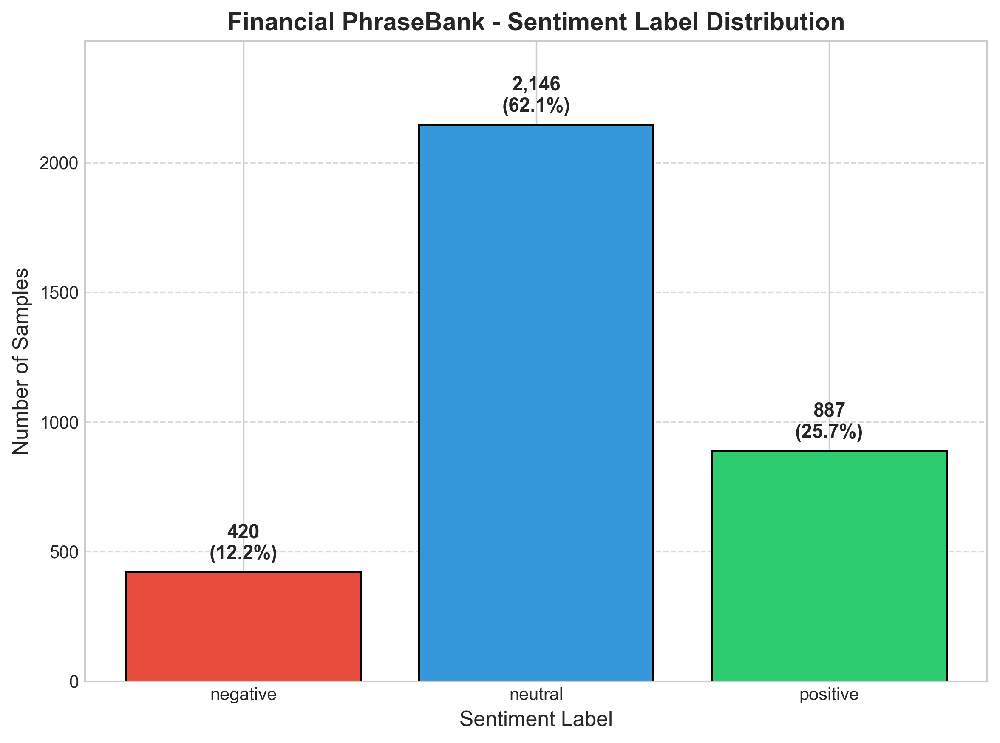

### Text Analysis

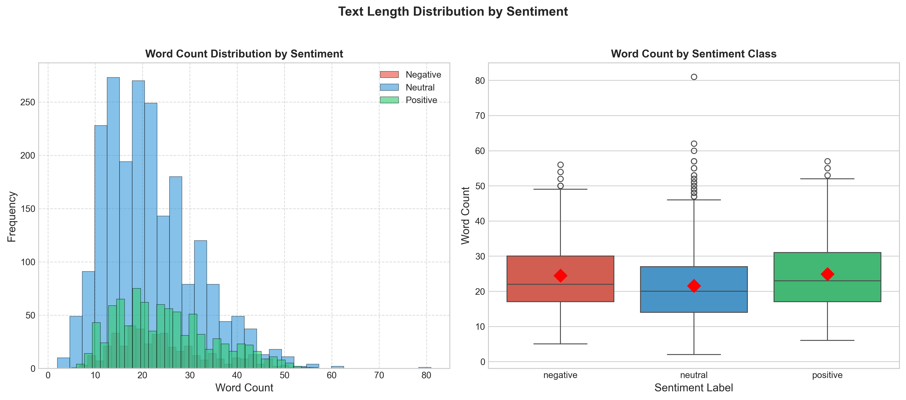

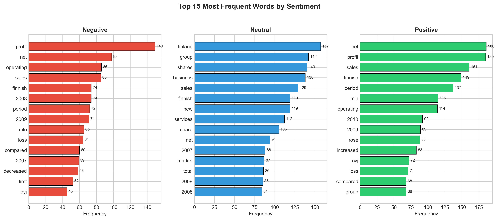

### Word Clouds by Sentiment

<p align="center">
  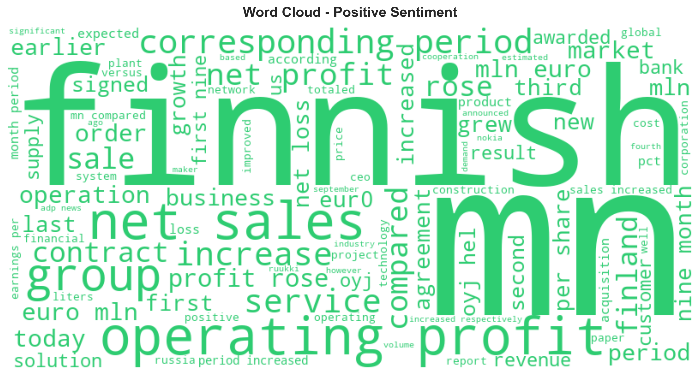
  
  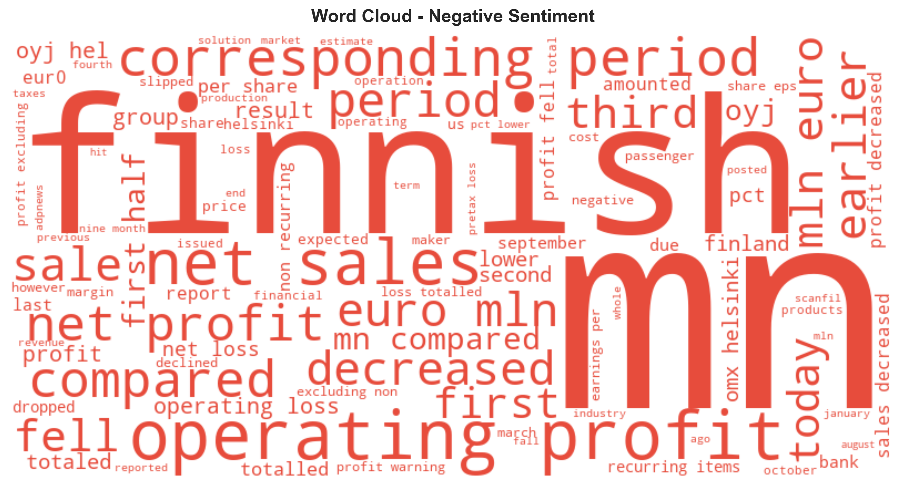
</p>

### Data Splits

| Split | Samples | Percentage |
|-------|---------|------------|
| Train | 2,417 | 70% |
| Validation | 518 | 15% |
| Test | 518 | 15% |

Stratified splitting ensures class proportions are preserved across all splits.

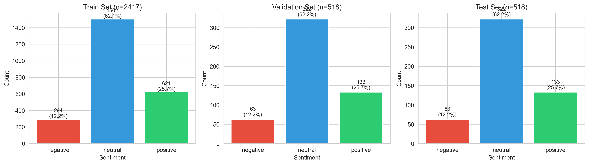

---

## Models

### FinBERT

- **Checkpoint:** `ProsusAI/finbert`
- **Base:** BERT-base architecture (110M parameters)
- **Pretraining:** Financial communications (corporate reports, analyst reports, financial news)
- **Why it works:** Understands financial terminology, context, and domain-specific sentiment expressions

### RoBERTa

- **Checkpoint:** `roberta-base`
- **Base:** RoBERTa-base architecture (125M parameters)
- **Pretraining:** General English corpus (books, Wikipedia, news)
- **Role:** Serves as a strong general-purpose baseline

### XLM-RoBERTa (Multilingual)

- **Checkpoint:** `xlm-roberta-base`
- **Base:** XLM-RoBERTa architecture (278M parameters)
- **Pretraining:** CommonCrawl data in 100+ languages (2.5TB)
- **Role:** Enables cross-lingual transfer — train on English, predict on Spanish/Russian/etc.

### Model Configuration

| Parameter | FinBERT | RoBERTa | XLM-RoBERTa |
|-----------|---------|---------|-------------|
| Learning Rate | 1e-5 | 2e-5 | 2e-5 |
| Batch Size | 16 | 16 | 16 |
| Max Epochs | 5 | 5 | 5 |
| Max Sequence Length | 128 | 128 | 128 |
| Weight Decay | 0.01 | 0.01 | 0.01 |
| Warmup Steps | 500 | 500 | 500 |
| Early Stopping Patience | 3 | 3 | 3 |
| Optimizer | AdamW | AdamW | AdamW |
| Scheduler | Linear warmup + decay | Linear warmup + decay | Linear warmup + decay |

---

## Results

### Model Performance Comparison (English)

| Model | Accuracy | F1 (weighted) | F1 (macro) | Best Epoch | Training Time |
|-------|----------|---------------|------------|------------|---------------|
| **FinBERT** | **95.95%** | **0.960** | **0.949** | 4 | 6.2 min |
| RoBERTa | 94.79% | 0.948 | 0.937 | 2 | 6.1 min |
| XLM-RoBERTa | 91.70% | 0.918 | 0.895 | — | 8.5 min |

**Key Finding:** FinBERT outperforms RoBERTa by **1.26%** in accuracy, confirming that domain-specific pretraining on financial corpora provides meaningful improvements for financial sentiment analysis.

### Cross-lingual Results (XLM-RoBERTa)

XLM-RoBERTa enables **zero-shot cross-lingual transfer** — the model is trained on English data and tested on Spanish without any Spanish training examples.

| Language | Accuracy | Notes |
|----------|----------|-------|
| English (test set) | 91.7% | Standard evaluation |
| Spanish (zero-shot) | 80.0% | No Spanish training data |
| **Transfer Efficiency** | **87.2%** | Spanish / English ratio |

#### Spanish Per-Class Performance

| Class | Accuracy | Correct/Total |
|-------|----------|---------------|
| Positive | 100% | 5/5 |
| Neutral | 100% | 5/5 |
| Negative | 40% | 2/5 |

The model struggles with negative Spanish sentences, likely because negative financial expressions differ more across languages than positive/neutral ones.

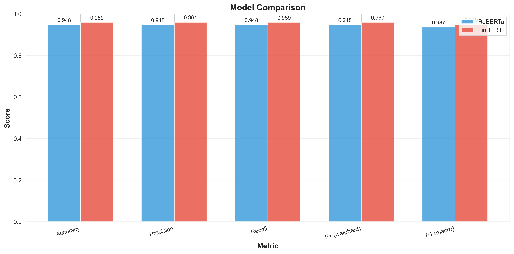

### Per-Class Performance (F1-Score)

| Class | FinBERT | RoBERTa | Difference |
|-------|---------|---------|------------|
| Negative | 0.938 | 0.928 | +0.010 |
| Neutral | 0.975 | 0.964 | +0.011 |
| Positive | 0.934 | 0.917 | +0.017 |

Both models perform best on the majority class (Neutral) and show slightly lower performance on minority classes (Negative, Positive), which is expected given the class imbalance.

### Training History

#### RoBERTa
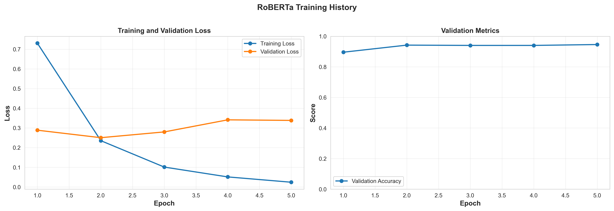

#### FinBERT
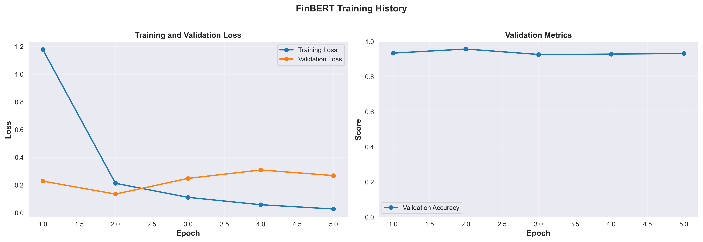

### Confusion Matrices

<p align="center">
  
  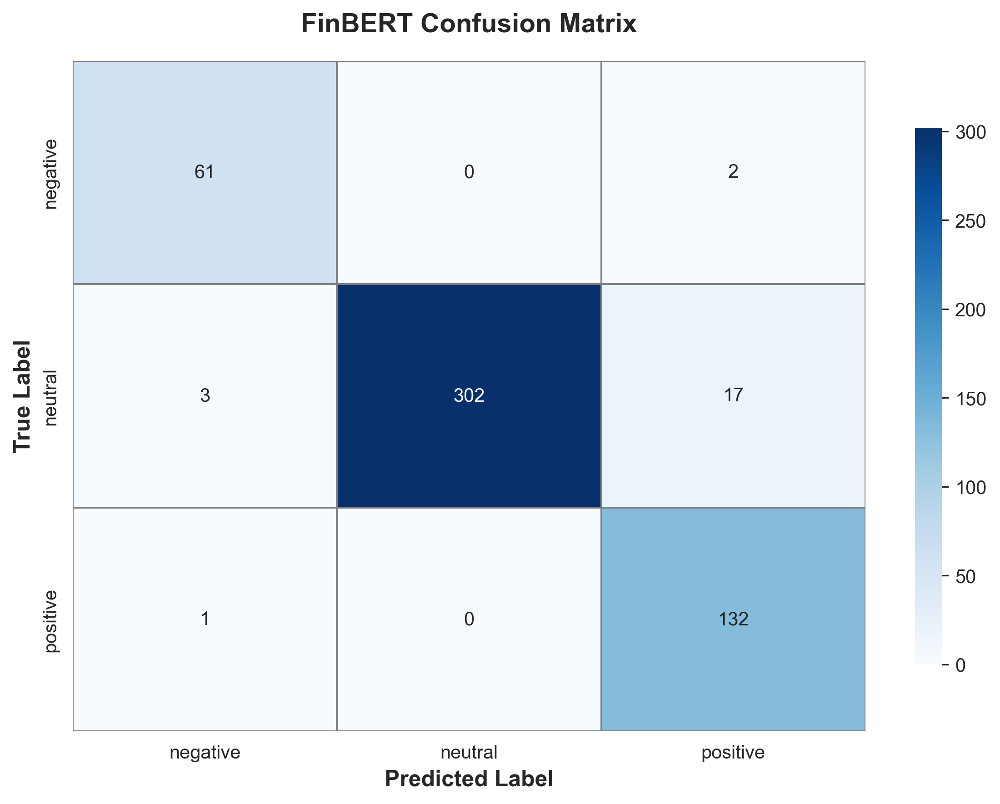
</p>

### Per-Class Metrics

<p align="center">
  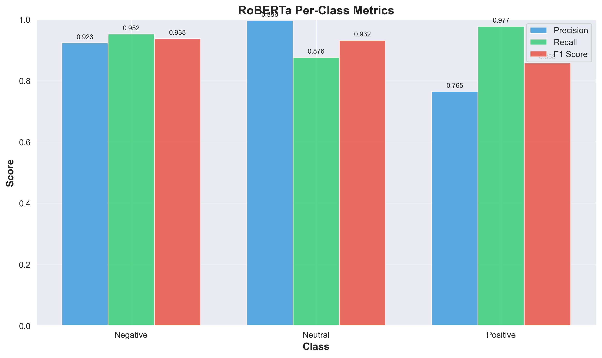
  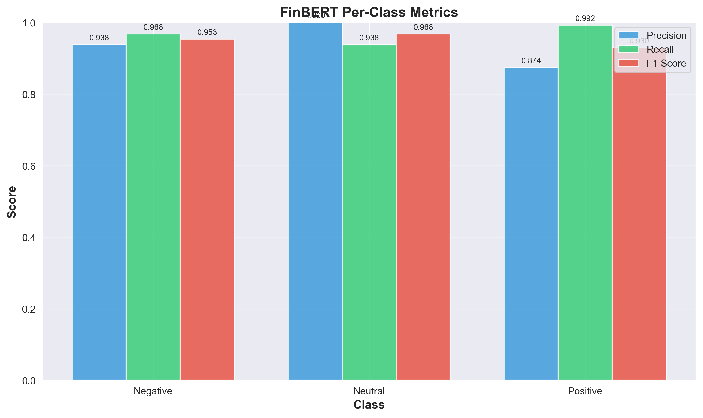
</p>

### Error Analysis

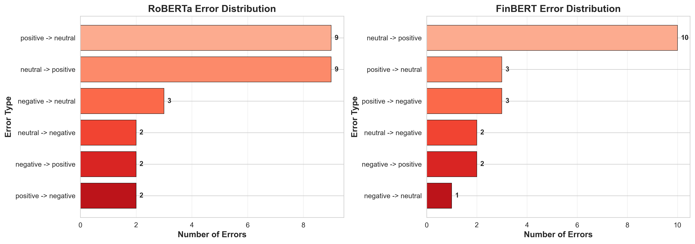

### Training Dynamics

**FinBERT:**
- Converged at epoch 4 with validation loss 0.188
- More stable training curve with gradual improvement
- Lower learning rate (1e-5) prevented overshooting

**RoBERTa:**
- Converged faster at epoch 2 with validation loss 0.251
- Required higher learning rate (2e-5) for effective fine-tuning
- Earlier convergence suggests less domain adaptation needed

---

## Inference Demo

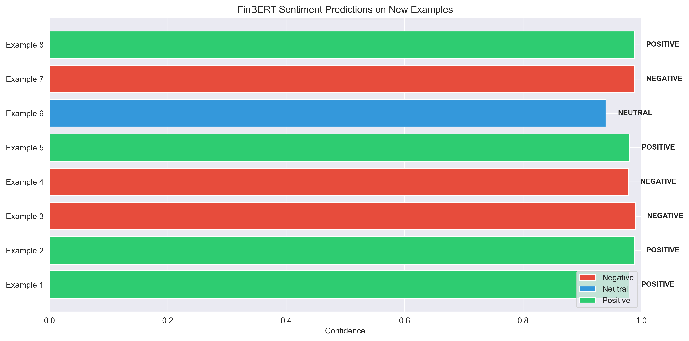

---

## Troubleshooting

**CUDA out of memory**
Reduce batch size in the notebook or config:
```python
batch_size = 8  # instead of 16
```

**Import errors in notebooks**
Add project root to Python path:
```python
import sys
from pathlib import Path
sys.path.insert(0, str(Path.cwd().parent))
```

**Slow training on CPU**
Training on CPU is possible but slow (~1 hour per model). GPU is strongly recommended.

**Windows multiprocessing issues**
Set `num_workers=0` in DataLoader creation if you encounter multiprocessing errors.

---

## References

### Dataset
- Malo, P., Sinha, A., Korhonen, P., Wallenius, J., & Takala, P. (2014). Good debt or bad debt: Detecting semantic orientations in economic texts. *Journal of the Association for Information Science and Technology*, 65(4), 782-796.

### Models
- [FinBERT by ProsusAI](https://huggingface.co/ProsusAI/finbert) — Financial domain BERT
- [RoBERTa by Facebook AI](https://huggingface.co/roberta-base) — Robustly optimized BERT
- [XLM-RoBERTa by Facebook AI](https://huggingface.co/xlm-roberta-base) — Multilingual RoBERTa (100+ languages)

### Libraries
- [HuggingFace Transformers](https://huggingface.co/transformers)
- [HuggingFace Datasets](https://huggingface.co/datasets)
- [PyTorch](https://pytorch.org/)

---

## License

This project is created for educational purposes.
